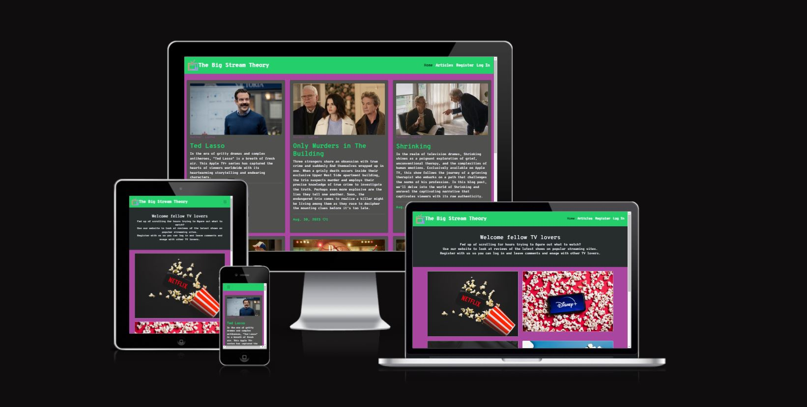
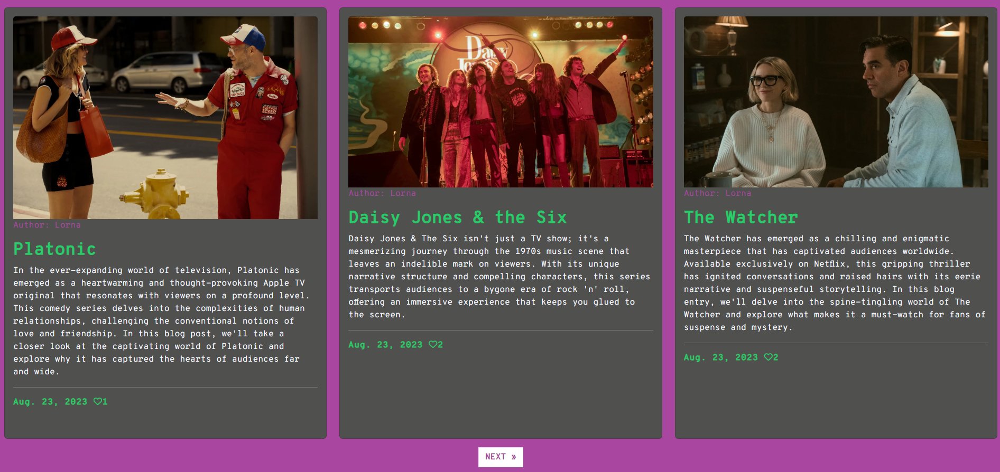
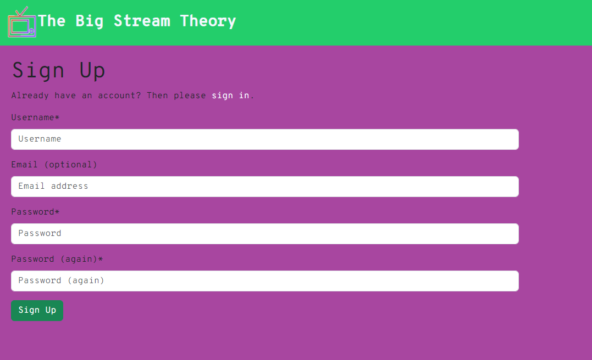
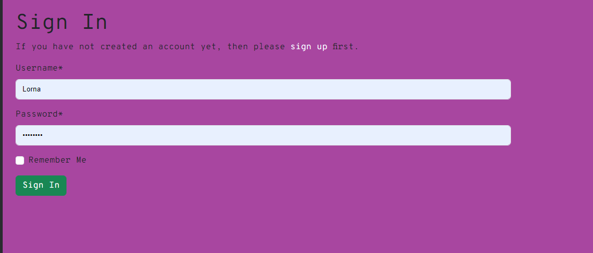
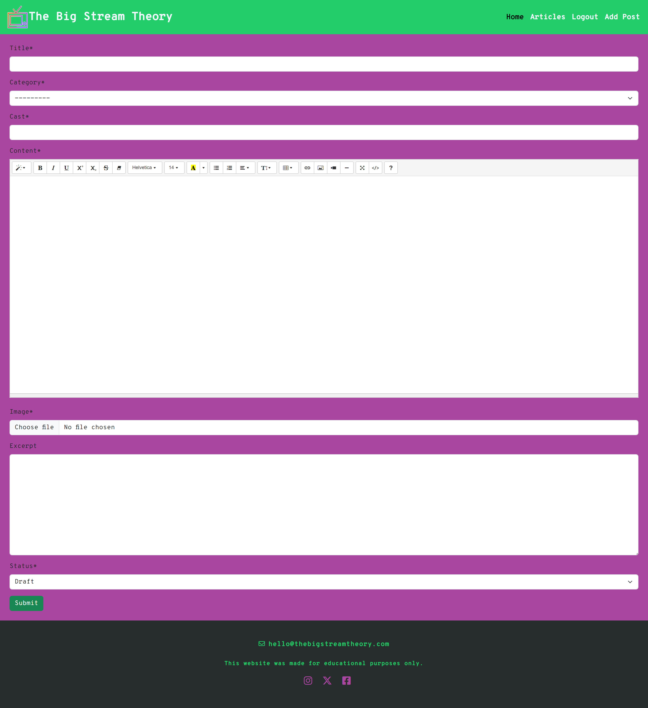
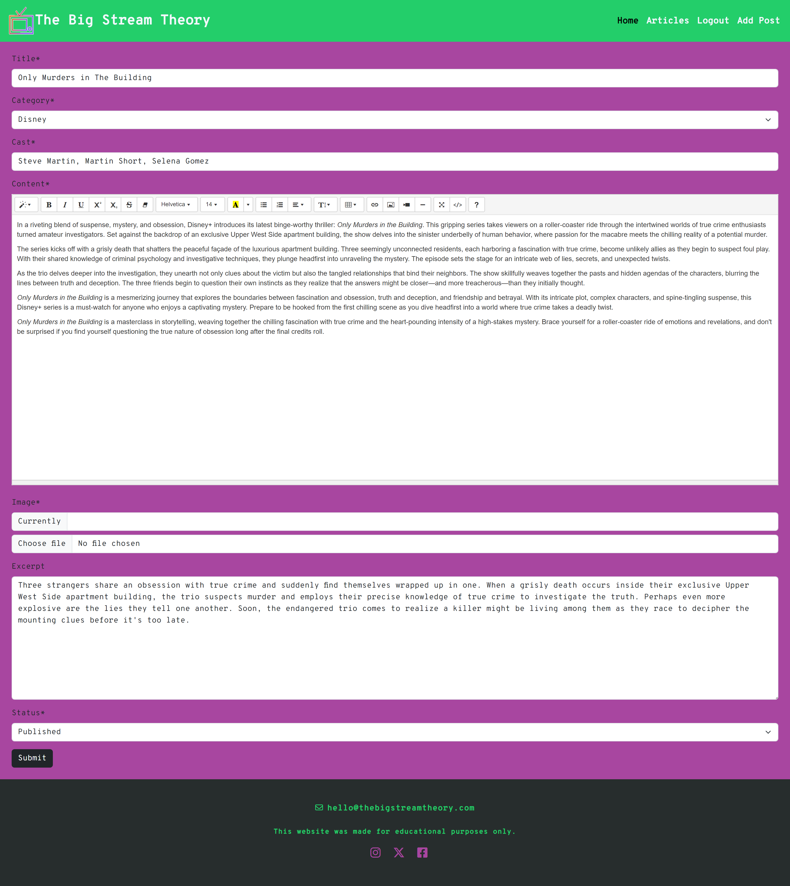
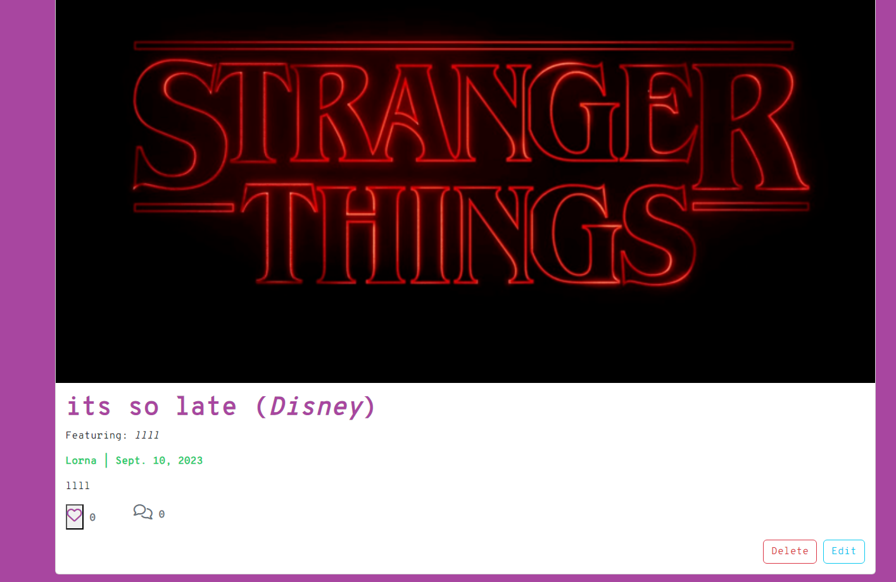

# The Big Stream Theory

[View live website](https://the-big-stream-theory-92a5f2837220.herokuapp.com/)

[View admin site](https://the-big-stream-theory-92a5f2837220.herokuapp.com/admin/login/?next=/admin/)

## Introduction

The Big Stream Theory is a website for televison enthusiasts. There is so much to watch theses days and with so many streaming sites available to us.
This website provides articles on Tv shows available on four of the the main streaming sites. Its a place where people can go and look at reviews on the latest TV shows.

Anybody can go and look at the website and the articles. Only logges in users can like articles and leave comments. All comments are subject to approval by website staff. Comments can be approved from the admin panel of the website.

Staff can log into the front end and create, update and delete articles.

### Project Goals

To create a repository of great blog articles about current TV shows on popular streaming sites. Where fellow TV lovers can come together and give their opinions and have discussions in the comments section. We want it to be a go to place when people are looking for something to watch and dont want to scroll for hours.

### Entity Relationship Diagram

The ERD was created on [Lucidchart](https://www.lucidchart.com/). It illustrates the relationship between theCategory, Post and Comment models.

## User Experience

This website was designed using the Five Planes of UX

### Strategy

User stories were written using GitHub Issues and were prioritised using the MoSCoW method. User stories along with testing can be found [here](TESTING.md).

### Scope

The project was scope was to implement CRUD functionaility for the user. This was implmented at at a staff level. Staff can Create articles, Read articles, Update articles and Delete articles.

### Structure

We kept a simple structure to the website so it is easy for the user to navigate. Using the base template to create a navbar and footer that follows through through the website. Menu items are easy to navigate to. We used cards throughout the website so the user gets used to clicking on these cards for information as they click through the website.

### Skeleton

Desktop wireframes were created at the inital planning stage and the design has varied slightly since due to time constraints and not being able to get the cards to work out the way I had initally planned.

- [Desktop wireframes created with excalidraw](documentation/images/desktop_wireframes.png)

- [Mobile wireframes created with Balsamiq](documentation/images/mobile_wireframes.png)

### Surface

#### Colour Scheme

I created a logo using [Free Logo Maker](https://www.namecheap.com/) and from there I like the colour scheme and went over to [Coolors](https://coolors.co/) to create the below colour pallette.

### Typography

Again I took inspiration from the logo I crated on the above website. I never ended up using the logo as I couldnt get it to fit on the bavbar properly. I liked the font they used which was Overpass which I imported from 

## Agile Development

[View project board](https://github.com/users/Lornavav/projects/4)

GitHub Issues and Projects were used to write and manage user stories and epics. The kanban board was used to maage stories into Todo, In Progress and Done columns. I used the MoSCoW method to label Must-Have and Could-Have stories. I did have the intention of adding some Should-Haves but didn't get around to it. I will mention some below in future features.

## Existing Features

### Navigation Bar

The navbar contains a logo and text both hyperlinked to redirect to the home page from any of the other web pages.

There are four states of the nav bar

- [Logged out state](documentation/images/navbar_logged_out.png)
- [User logggd in](documentation/images/navbar_user.png)
- [Admin logged in](documentation/images/navbar_admin.png)
- [Responsive navbar for mobile](documentation/images/navbar_responsive.png)

### Category Cards

The category cards are displayed on the index.html page. These will help the user navigate to the content they want to see. All cards are clickable and will take the user to the blog post of that category.

### Footer

The footer can be viewed from every webpage throughout the side. It contains a contact email for users to get in touch. The social media links all redirect to the relative login pages and these pages will open in a new tab.

### Articles Page

The articles page is where a user can view all articles contained on the website. The page will paginate after 6 articles. The user can click on any article and it will bring them to a page to see further details of the article.

### Article Detail Page

The article detail page shows further details on a single article post. This is where logged in users can leave a comment or like a post. Users who are not logged in will be promted to log in.

- [Article detail page logged in user](documentation/images/article_detail_page.png)
- [Article detail pages not logged in](documentation/images/article_details_not_logged_in.png)

#### Register

The user will be giving the option to register on the website if they are not logged in. This option will appear in the navbar. The user will be directed to a sign up form where they fill in a username, optional email adress and a password.

### Sign In

Once a user is registered on the website they can use the sign in option to sign into the website.

### Add Post

Staff have access to add an article post on the front end. When they sign into the website using a staff account they will see the option to add post. Here they can add posts and publish them or leave them as drafts. If they publish the post they will appear straight away on the articles page. If a post is saved as a draft this will not appear anywhere on the website only on the admin panel.

### Edit Post

Staff have access to edit posts from the front end. The option to edit a post will appear on the articles details page when a staff member is logged into the site.

### Delete Post

Staff have access to delete posts from the front end. The option to delete a post will appear on the articles details page when a staff member is logged into the site.

### Messages

Alert messages were implmented with the help of Django messages and message tags.

- [Message example](documentation/images/messaging.png)
- [Message with name example](documentation/images/messaging_with_name.png)

### Feature Left to Implement

- Feature for users to edit their comments (user story still in to dob column from this project).
- Feature for users to edit their comments (user storu still in to do column from this project).
- Admin to be able to approve comments from the front end.
- Feature for draft post to be stored on the front end with admins been able to log in and view them/publish them.
- Favicon to add to website, that was last on my to do list before submission but I never got around to it.
- Implement custom 404 page, that was last on my to do list before submission but I never got around to it.
- When editing a post the current image doesn't show, I would like to fix this.
- Profile page for user, with menu items stored withing the profile.
- Special menu bar for the admin to manage posts/carry out admin functions.
- Add javascript to messages so they close automatically and look at styling and positioning of messages.

## Technologies Used

- [HTML](https://html.com/html5/) used as the mark-up language.
- [CSS](https://en.wikipedia.org/wiki/CSS) for styling.
- [Python](https://www.python.org/) used as the programming language.
- [Django](https://www.djangoproject.com/) framework inlluding some of the below frameworks.
  - [Django Crispy Forms](https://django-crispy-forms.readthedocs.io/en/latest/) for form styling and helpers.
  - [Django allauth](https://django-allauth.readthedocs.io/en/latest/) provided templates for sign in, sign up and sign out.
  - [Crispy Bootstrap 5] template pack for boostrap 5.
  - [Django summernot] for rich text editor for adding posts.
- [ElephantSQL](https://www.elephantsql.com/) database used.
- [Bootstrap 5](https://pypi.org/project/crispy-bootstrap5/) for website styling.
- [Cloudinary](https://cloudinary.com/) to store static files.
- [GIT] for version control.
- [GiHub](https://git-scm.com/) for repository and issues and project board.
- [Codeanywhere](https://app.codeanywhere.com/) fs IDE.
- [Heroku](https://www.heroku.com/) for website deployment.
- [Google Fonts](https://fonts.google.com/) for typogoraphy.
- [Font Awesome](https://fontawesome.com/) for website icons.
- [Balsamiq](https://balsamiq.com/) for mobile wireframes.
- [Excalidraw](https://excalidraw.com/) for desktop wireframes.
- [Lucidchart](https://www.lucidchart.com/) for ERD diagram.
- [Coolors](https://coolors.co/) for colour scheme.
- [Shutterstock](https://www.shutterstock.com/) for 4 category images on index page.

## Testing and Validation

Testing documentation can be found at [TESTING.md](TESTING.md)

## Deployment

### Deployment with Heroku

- Created an account with Heroku and log in through the [Heroku](https://www.heroku.com/) website.
- From the dashboard click on the 'New' option and selected 'Create New App.
- Add in an app name and choose a region and click 'Create app'.
- Click on the 'Settings' tab and from the 'Config Vars' section click 'Reveal Config Vars'
- Still in settings click to reveal 'Config Vars' add PORT into the 'KEY' field and 8000 into the 'VALUE' field and click 'Add'.
  - For my project I also needed to add my database url, secret key and coudinary url in the config vars section.
- From the buildpacks section click 'Add buildpack'.
- Go to the 'Deploy' tab and under 'Deployment Method' click on 'GitHub'.
- From the 'Connect to GitHub' section ensure the correct repository is selected and then search for the repository you want to connect to and click 'Connect'.
- You can choose an automatic deploy or a manual deploy. I chose a manual deploy.
- With a manual deploy I made sure the main branch was selected and clicked 'deploy branch'.
- Once the build is finished there should be a message saying 'Your app was successfully deployed' with a 'View' button.
- When I click on 'View' this opened the application.

### Steps to clone site

To create a copy of the repository on your own account, follow the below steps:

- Navigate to [My Repository Page](https://github.com/Lornavav/The-Big-Stream-Theory).
- Click on 'Fork' up on the top right of the page.
- There will now be a copy of the original repository in your Github account.

## Credits

### Code

- CI codestar blog walkthrough which I heavily followed and the follow up webinar to go with it. Thanks to Matt Rudge for explaining everything at a nice pace.
- Two repositories shared by my facilitator Paul Thomas which were both a massive help to me.
  - [Designland](https://designland.herokuapp.com/)
  - [Cocktail Nerd](https://project4-cocktail-nerd.herokuapp.com/)
- [Codemy](https://www.youtube.com/playlist?list=PLCC34OHNcOtr025c1kHSPrnP18YPB-NFi) the blog alkthrough was helpful for categories.

### Media

- Shutterstock as memtioned about for the 4 category images displayed on the index page. I signed up for a free trial to avail of these.
- I struggled to find royalty free images of the TV shows I wantes to display so I have linked all images sources below:
  - [The Bear image]( https://www.gq.com/story/the-bear-chicago)
  - [Shrinking image]( https://www.joblo.com/shrinking-review)
  - [The Night Agent](https://www.gq-magazin.de/artikel/gabriel-basso-interview)
  - [Daisy Jones & the six image](https://www.gq-magazine.co.uk/culture/article/daisy-jones-and-the-six-fleetwood-mac)
  - [The watcher image](https://www.gq-magazine.co.uk/culture/article/the-watcher-ending-netflix)
  - [Platonic image](https://www.gq.com/story/seth-rogen-platonic-outfits-interview)
  - [Only Murders in the Building](https://www.gq.com/story/seth-rogen-platonic-outfits-interview)
  - [Ted Lasso](https://www.gq.com/story/seth-rogen-platonic-outfits-interview)
- I used ChatGPT to generate the main content fot the blog posts.

### Acknowledgements

I would like to thank the guys in my cohort for always being encouraging and sending on great resources. Special thanks to Indrek who helped figure out a couple of issues for this project. Thanks to Dave for listening to me and for all the resources. And to Paul Thomas our wonderful facilitator who always checks in with us and is extremely approachable. Thanks to tutor support who I leaned on for this project more than ever and to student support for being so responsive when I have concerns. Lastly thanks to my mentor Brian O' Hare for always being encouraging and easy to talk to.