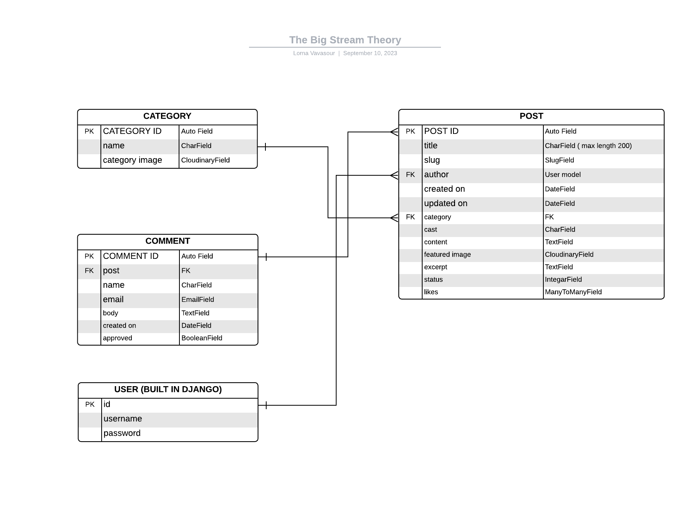
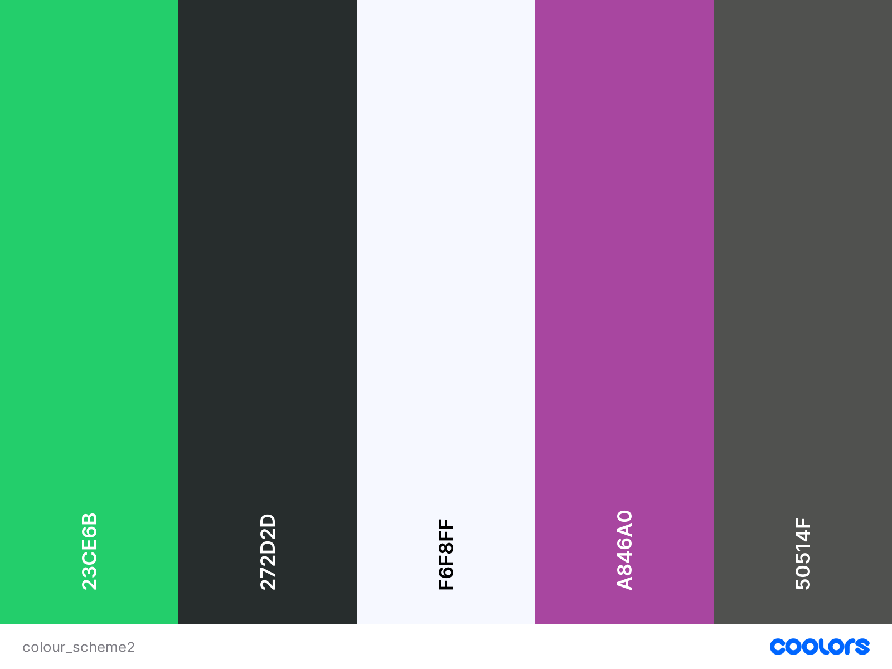

# The Big Stream Theory

*I AM RESPONSIVE TO GO HERE*

[View live website](https://the-big-stream-theory-92a5f2837220.herokuapp.com/)

[View admin site](https://the-big-stream-theory-92a5f2837220.herokuapp.com/admin/login/?next=/admin/)

## Introduction

The Big Stream Theory is a website for televison enthusiasts. There is so much to watch theses days and with so many streaming sites available to us.
This website provides articles on Tv shows available on four of the the main streaming sites. Its a place where people can go and look at reviews on the latest TV shows.

Anybody can go and look at the website and the articles. Only logges in users can like articles and leave comments. All comments are subject to approval by website staff. Comments can be approved from the admin panel of the website.

Staff can log into the front end and create, update and delete articles.

### Project Goals

To create a repository of great blog articles about current TV shows on popular streaming sites. Where fellow TV lovers can come together and give their opinions and have discussions in the comments section. We want it to be a go to place when people are looking for something to watch and dont want to scroll for hours.

### Entity Relationship Diagram

The ERD was created on [Lucidchart](https://www.lucidchart.com/). It illustrates the relationship between theCategory, Post and Comment models.

## User Experience

This website was designed using the Five Planes of UX

### Strategy

User stories were written using GitHub Issues and were prioritised using the MoSCoW method. User stories along with testing can be found HERE 

### Scope

The project was scope was to implement CRUD functionaility for the user. This was implmented at at a staff level. Staff can Create articles, Read articles, Update articles and Delete articles. 

### Structure

We kept a simple structure to the website so it is easy for the user to navigate. Using the base template to create a navbar and footer that follows through through the website. Menu items are easy to navigate to. We used cards throughout the website so the user gets used to clicking on these cards for information as they click through the website.

### Skeleton

Desktop wireframes were created at the inital planning stage and the design has varied slightly since due to time constraints and not being able to get the cards to work out the way I had initally planned.

* [Desktop wireframes created with excalidraw](documentation/images/desktop_wireframes.png)

* [Mobile wireframes created with Balsamiq](documentation/images/mobile_wireframes.png)
  
### Surface

I created a logo using [Free Logo Maker](https://www.namecheap.com/) and from there I like the colour scheme and went over to [Coolors](https://coolors.co/) to create the below colour pallette.

## Agile Development

[View project board](https://github.com/users/Lornavav/projects/4)

GitHub Issues and Projects were used to write and manage user stories and epics. The kanban board was used to maage stories into Todo, In Progress and Done columns. I used the MoSCoW method to label Must-Have and Could-Have stories. I did have the intention of adding some Should-Haves but didn't get around to it. I will mention some below in future features.

## Existing Features

### Navigation Bar

The navbar contains a logo and text both hyperlinked to redirect to the home page from any of the other web pages.

There are four  states of the nav bar

* [Logged out state](documentation/images/navbar_logged_out.png)
* [User logggd in](documentation/images/navbar_user.png)
* [Admin logged in](documentation/images/navbar_admin.png)
* [Responsive navbar for mobile](documentation/images/navbar_responsive.png)

### Category Cards

### Footer

### Articles Page

### Article Detail Page

#### Register

### Sign In

### Add Post

### Edit Post

### Delete Post

### Comment on a post

### Like a post

### Messages

## Technologies Used

### Languages

## Testing and Validation

Testing documentation can be found at [TESTING.md](TESTING.md)

## Deployment

### Steps to deploy site using Heroku

### Steps to clone site

## Credits

### Code

### Media

### Acknowledgements