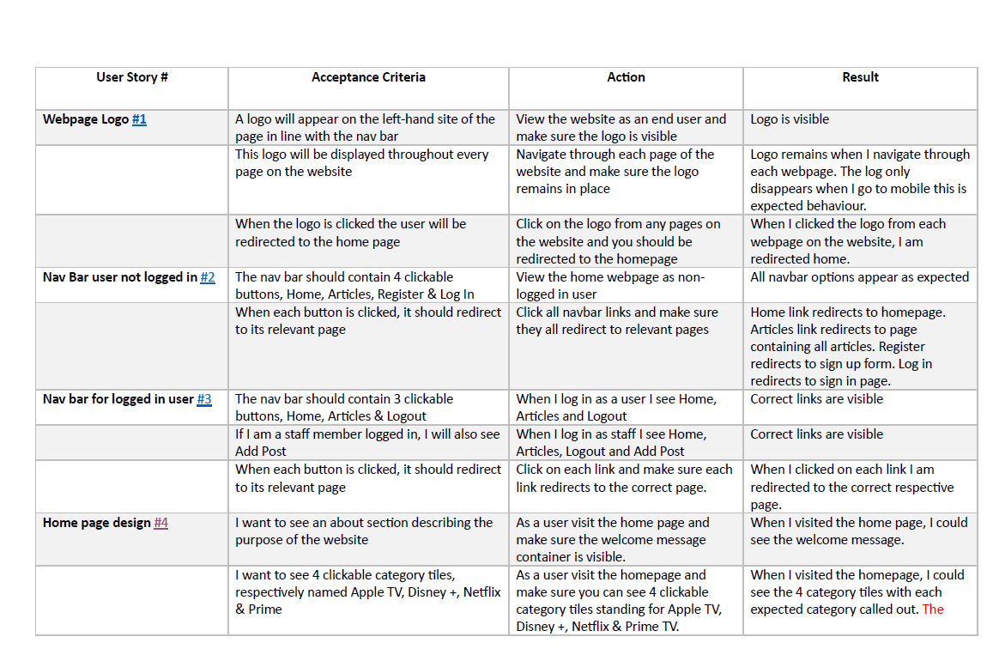
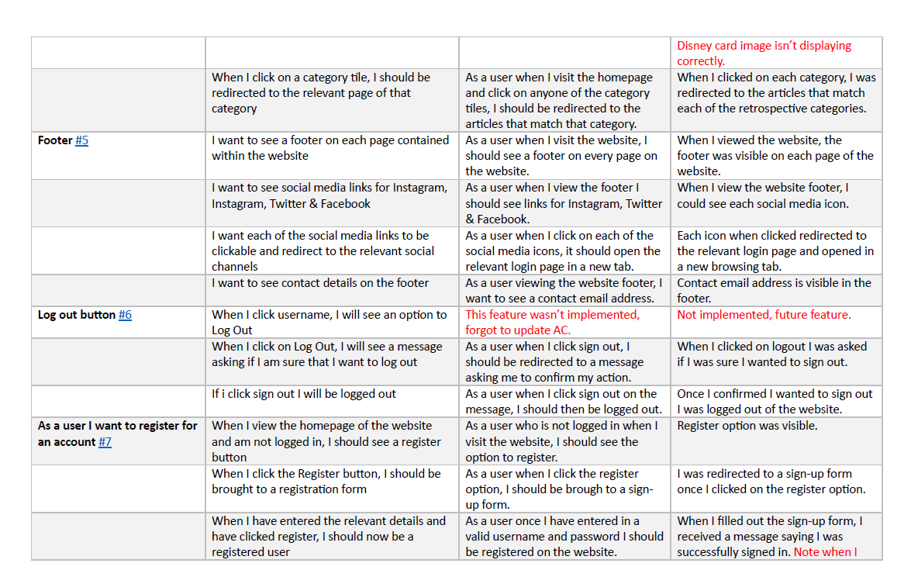
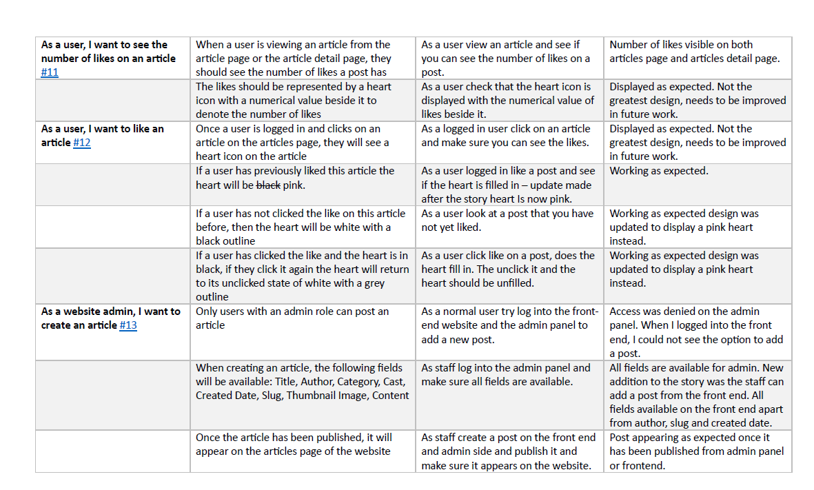
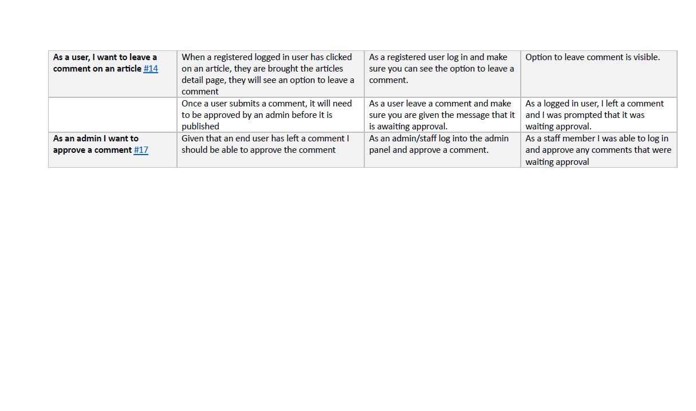

## Mannual Testing

Mannual testing was carried on all user storie that were implmented.

## Responsive Design

Responsive design testing was carried out on all simulated devices available on Google Chrome dev tools and the website was responsive on all devices.

I also tested the responsiveness on my own phone which is an iPhone 11.

## Browser Compatibility

I tested the website on Chrome desktop and Edge desktop. No issues found on either unless already called out in the bug section.

## Performance Testing